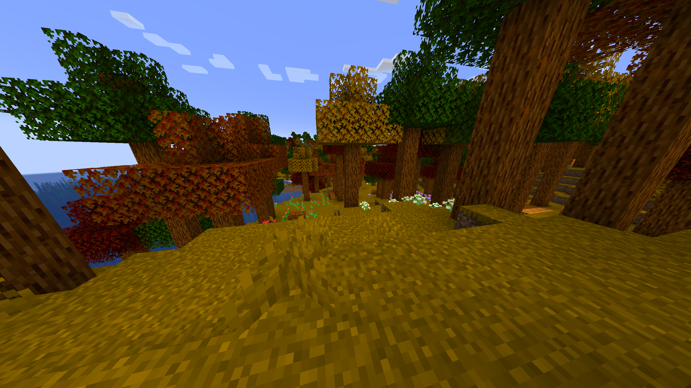

# Maple-Forest
This mod adds a maple forest to the game. And not some random forest that was lazily put together, but one with multiple different tree colours to reflect reality.
It also has fallen logs, pumpkin patches and flowers, along with some bee nests to make it feel alive. 
You can also add sap (maple syrup) onto some pancakes and make a nice meal!

Here are some pictures:

https://discord.gg/fMSnenNSXM 
